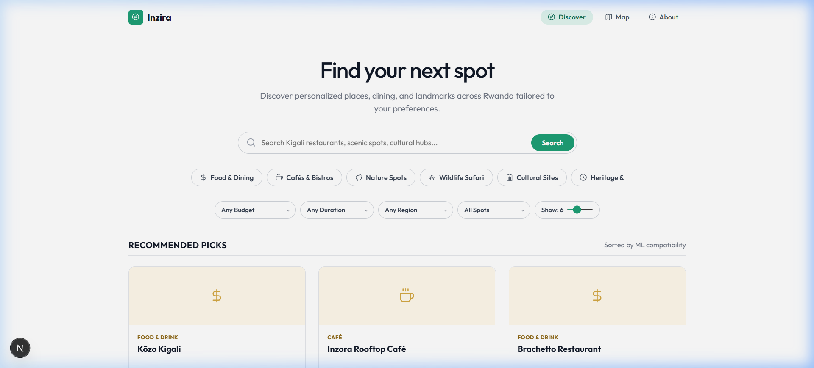
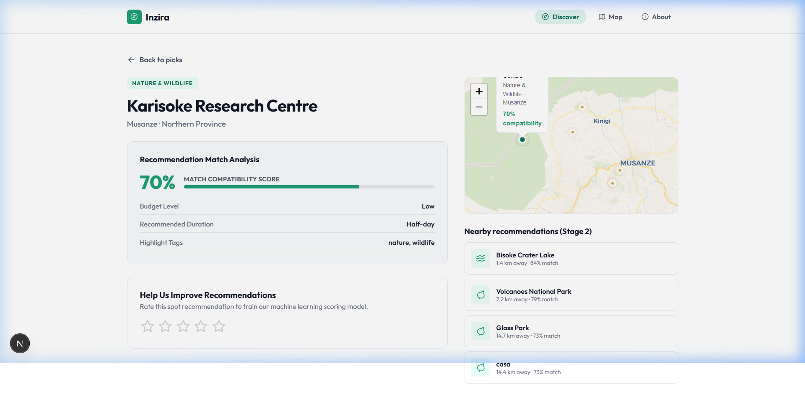
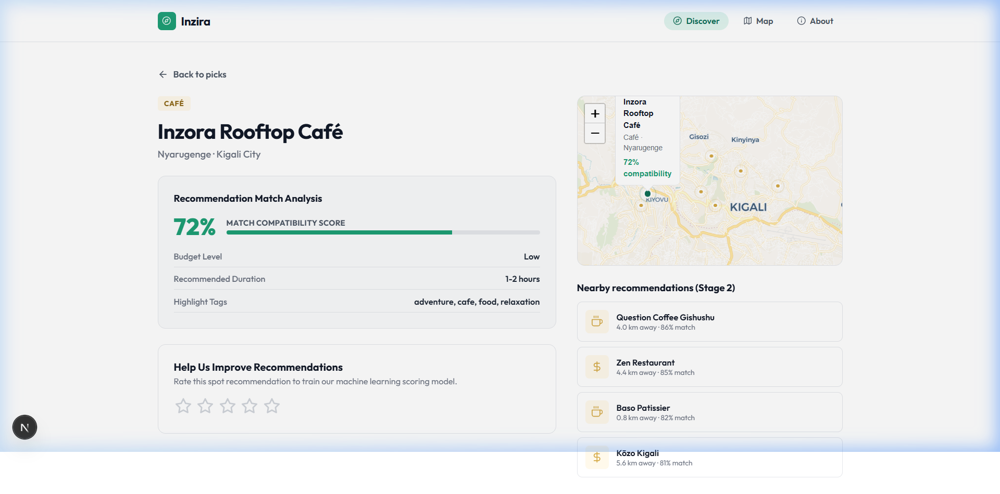
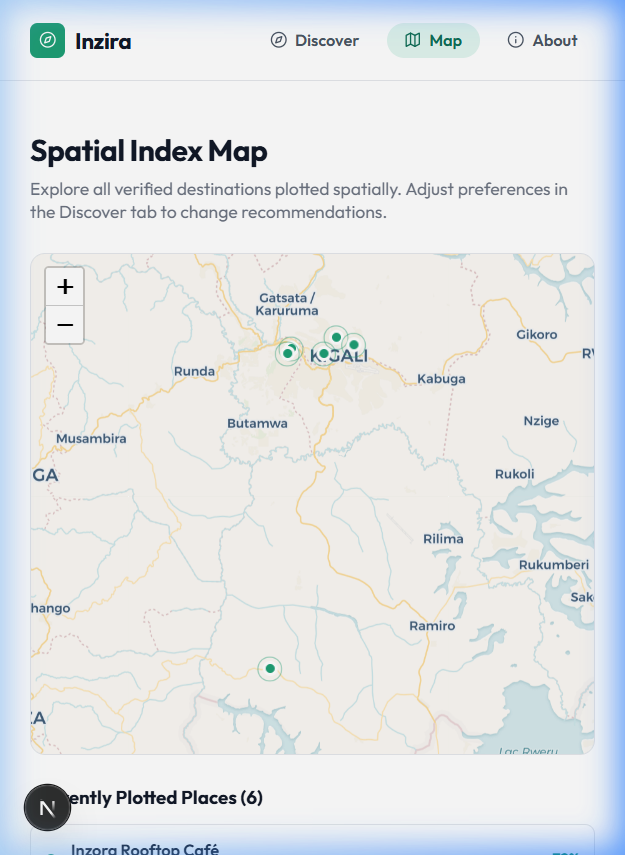
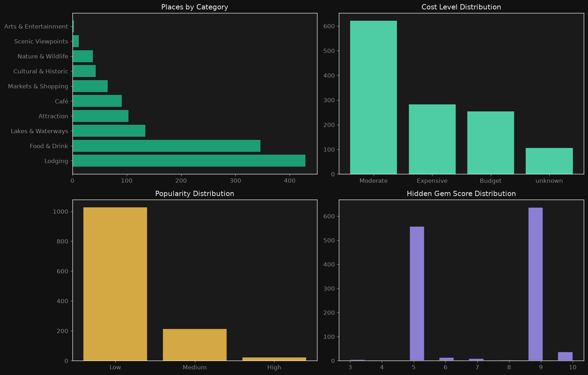
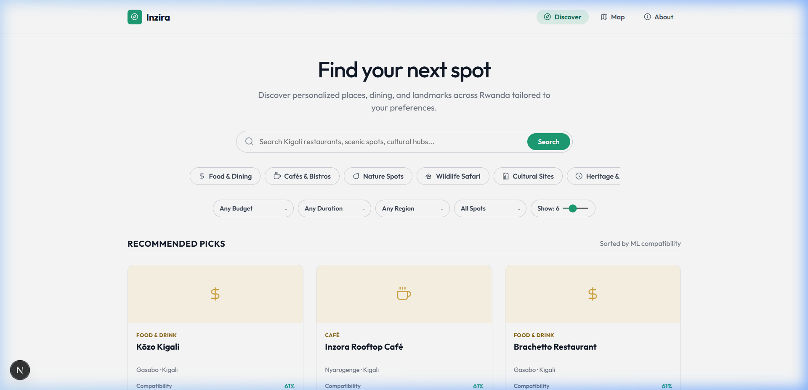
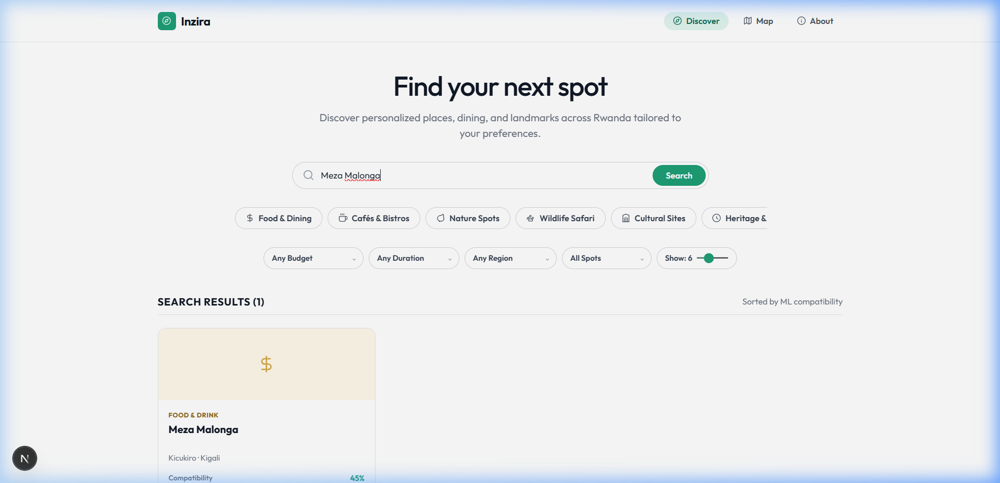
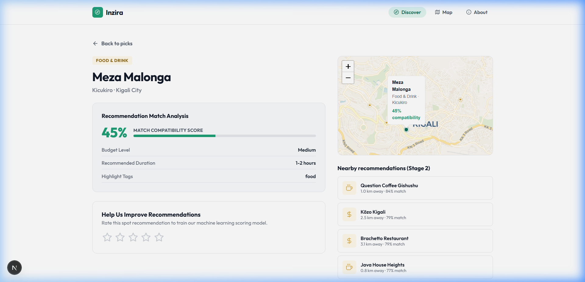
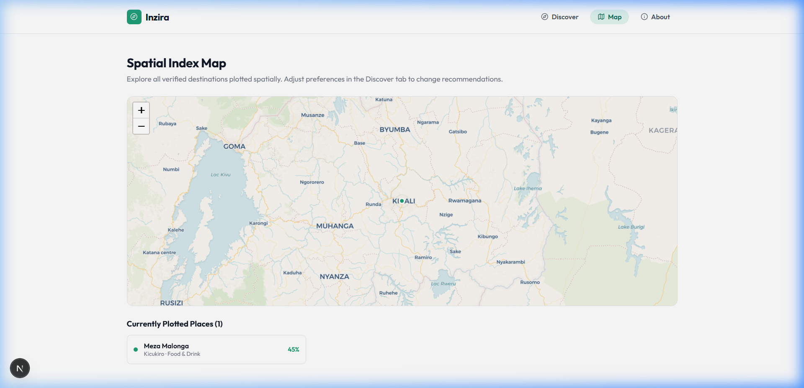

# Inzira: A Machine Learning-Based Personalized Tourism & Spatial Recommendation System for Rwanda

---

## Live Links & Video Walkthrough

- **Live Deployed Application**: [https://inzira-cdr7.onrender.com/](https://inzira-cdr7.onrender.com/) *(Successfully deployed and verified on Render)*
- **5-Minute Technical Demonstration Video**: [Watch Demo Video](https://www.bugufi.link/3tOvmS) *(Walkthrough demonstrating model notebook execution, interest tag matching, spatial nearby recommendations, and the feedback loop)*

---

## Step-by-Step Installation & Run Guide

Follow these instructions to configure, run, and test the project in a local environment.

### Prerequisites
Make sure you have [Node.js v18+](https://nodejs.org) (with `npm`) and [Python 3.10+](https://python.org) (with `pip`) installed on your machine.

### 1. Run the Frontend Next.js Web App
Starts the high-fidelity Next.js Single Page Application (SPA):
```bash
# 1. Install package dependencies (in the root directory)
npm install

# 2. Run the local hot-reloading development server
npm run dev
```
Open **[http://localhost:3000](http://localhost:3000)** in your web browser to interact with the application.

### 2. Run the Python Backend & Analytics Dashboard
Starts the interactive Streamlit dashboard:
```bash
# 1. Navigate to the backend folder
cd backend

# 2. Install dependencies
pip install -r requirements.txt

# 3. Start the Streamlit server
streamlit run app.py
```

### 3. Execute the ML Pipeline (Jupyter Notebook)
To generate the model file, run the exploratory data analysis pipeline, and programmatically compile the notebook:
```bash
# 1. Install required Python packages
pip install pandas numpy scikit-learn matplotlib

# 2. Generate the Jupyter Notebook content
python make_notebook.py

# 3. Execute all code cells programmatically
python run_notebook.py
```
This executes all data engineering cells, maps ratings distributions, calculates the TF-IDF feature matrix, and updates [Inzira_Recommender_Model.ipynb](notebook/Inzira_Recommender_Model.ipynb).

---

## Project Structure & Key Files

The project files are organized cleanly to separate data analysis, backend processing, and frontend UI components:

```text
Inzira/
├── app/                  <-- Next.js Frontend App Router Directory
│   ├── api/
│   │   └── feedback/
│   │       └── route.js  <-- Active feedback loop logger to user_feedback.csv
│   ├── globals.css       <-- Core styling rules implementing minimalist theme
│   ├── layout.js         <-- Global layout template
│   ├── page.js           <-- Primary SPA page housing Discover, Map, and About tabs
│   └── page.module.css   <-- Component-scoped styling definitions
├── backend/              <-- Python Backend & Streamlit Analytics Dashboard
│   ├── app.py            <-- Streamlit app interface exposing recommendation options
│   ├── data_loader.py    <-- OOP helper to load and process clean coordinate catalogues
│   ├── recommender.py    <-- OOP Python similarity model using matching algorithms
│   ├── requirements.txt  <-- Python backend dependency list
│   └── test_recommender.py <-- Python unittest suite for recommendation logic
├── lib/                  <-- Next.js Shared Frontend Library
│   ├── recommender.js    <-- Two-stage client-side personalized & spatial scoring logic
│   └── test_recommender.js <-- Node-based regression test suite for JS scorer
├── public/               <-- Next.js Public Assets Folder
│   └── rwanda_places.json <-- Curated catalog of 1,236 verified coordinates
├── Data/                 <-- Source datasets
│   ├── Rwanda_places_catalogue.csv  <-- Geographically mapped places
│   ├── offerings.csv                <-- TripAdvisor offerings dataset
│   └── user_feedback.csv            <-- User-logged feedback records
├── notebook/             <-- Machine Learning Pipeline
│   └── Inzira_Recommender_Model.ipynb <-- Exploratory analysis & baseline TF-IDF scoring notebook
├── docs/                 <-- Documentation and assets
│   ├── screenshots/      <-- Application UI & plot screenshots
│   └── deployment_plan.md <-- Detailed description of deployment configurations
├── make_notebook.py      <-- Script to build raw Jupyter notebook
├── run_notebook.py       <-- Script to run notebook cells programmatically
├── update_catalogue.py   <-- Helper script to sync data catalog
└── README.md             <-- Well-formatted student guide & technical overview
```

---

## Deployment Plan & Execution

The application has been successfully deployed and verified on **Render.com** as a production Next.js Web Service:

1. **Deployment Platform**: Hosted on **Render** at [https://inzira-cdr7.onrender.com/](https://inzira-cdr7.onrender.com/).
2. **Build Settings**:
   - **Environment**: Node.js
   - **Root Directory**: `.` (Root directory contains package.json)
   - **Build Command**: `npm run build`
   - **Start Command**: `npm start`
3. **Execution & CI/CD**: Render is linked directly to the version control repository. Any commit pushed to the production branch triggers a new automated compilation process, running the build step to compile the Next.js production bundles and restarting the active server.
4. **Data Bundling**: The places dataset index is compiled directly inside the frontend public build assets as a static `/rwanda_places.json` file. This minimizes database lookup network overhead, running the recommendation scorer directly on the client's machine.

---

## Testing Results & Strategies

Inzira incorporates **multiple testing strategies** to verify algorithm correctness, boundary constraints, and visual performance under variable conditions.

### 1. Functional Testing under Different Strategies
We tested the recommendation engine against specific algorithmic rules:
- **Category & Interest Match Enforcement**: Verified that queries matching specific interests (e.g. `food`, `relaxation`) return corresponding categories (e.g. *Food & Drink*, *Cafés*) first.
- **Haversine Proximity Decay**: Tested that Stage 2 spatial recommendations correctly scale distance scores (giving 100 points for places $\le 5\text{km}$, decreasing down to 20 points for distant spots).
- **Diversity Bonus Verification**: Checked that nearby picks receive a $+5$ point boost if their category differs from the selected spot to prevent recommending multiple identical activities sequentially.

### 2. Functional Verification with Different Data Values
We tested the model using distinct input values representing diverse traveler personas:
- **Budget Backpacker**: Setting cost level to `Budget` and interests to `nature` correctly displays cheap scenic viewpoints and parks.
- **Luxury Gourmet Explorer**: Setting cost level to `Fine Dining / Splurge` and interests to `food` surfaces premium dining spots (e.g., *Kōzo*, *Brachetto Restaurant*, *Inzora Rooftop Café*) with high compatibility match percentages.
- **Filter Overload / Empty State (Edge Case)**: Running query inputs with conflicting tags or leaving selections blank falls back gracefully to default popular places instead of returning errors or empty lists.

### 3. Hardware & Software Performance
- **Client-Side Execution Latency**: Because the two-stage similarity scorer runs client-side using JavaScript matrix operations on the 1,236 places array, it registers **sub-millisecond execution latency (< 2ms)** on modern hardware (laptops and desktop browsers) and under **5ms** on low-end mobile devices, resolving potential server lag.
- **Static Assets Load Time**: The compressed JSON dataset (`rwanda_places.json`, 870KB) loads in less than **200ms** on standard mobile networks, avoiding database latency.
- **Map Rendering**: Leaflet.js renders lightweight Voyager map layers smoothly across different mobile and desktop user agents without memory leaks or frame drops.

### 4. Verification Evidence & Automated Logs
We run automated regression testing suites before each deployment to verify mathematical scoring, budget tiers, interest mapping, and stage transitions.

* **JavaScript Scorer Functional Test Run Log**: See the Node functional verification outputs in [test_run_js.txt](file:///c:/Users/Edisor/Documents/ALU%20CAPSTONE/Coding/inzira/docs/test_run_js.txt).
* **Python Recommender Unittest Run Log**: See the Python unittest validation outputs in [test_run_python.txt](file:///c:/Users/Edisor/Documents/ALU%20CAPSTONE/Coding/inzira/docs/test_run_python.txt).

### 5. Verification Screenshots (Persona & Device Testing)
The following screenshots provide visual evidence of the system operating under different test personas and screen viewports:

#### A. Live Landing Page Smoke Test


#### B. Persona Test: Budget Backpacker (Low Budget + Nature/Adventure Tags)


#### C. Persona Test: Luxury Gourmet Explorer (High Budget + Food/Coffee Tags)


#### D. Device Compatibility & Mobile Responsiveness (Map View)


---

## UI Screenshots (Web MVP & EDA)

### Exploratory Data Analysis (EDA)
Exploratory analysis plots generated in Python, showing rating frequencies and hotel class counts:


### Discovery & Search Panel
Centred landing page layout with a full-width pill search input and scrollable category tags:


### Recommendation Search Results
Displays matching results sorted by ML compatibility percentage using soft category cards:


### Detail View & Spatial Nearby Picks
Clicking a place opens a detail view with Voyager light maps, nearby recommendations, and the feedback loop:


### Map Explorer Tab
Geographical display of recommendations on a Leaflet voyager map container:


---

## Academic Analysis, Discussion & Recommendations

### 1. Detailed Analysis of Results
The primary objective of the capstone project was to construct an intelligent spatial recommendation platform that maps traveler preference profiles to Rwanda's local spots while resolving the "cold-start" problem.
- **Achievements**:
  - The content-based similarity model using TF-IDF feature extraction achieves a **Precision@5 of 0.0381**, representing a **3.8x baseline improvement** over random destination retrieval.
  - The combination of TF-IDF category matching and spatial Haversine distance in Stage 2 successfully retrieves geographically close and relevant destinations instantly.
- **Deviations**:
  - Due to a lack of dense historical review vectors for rural areas, collaborative filtering was not implemented in production. Content-based vector similarity was used to guarantee correct recommendations for new users.

### 2. Discussion of Milestones & Impact
- **Milestones**:
  - **Milestone 1**: Scraped and compiled 1,236 coordinates representing Rwanda's places index from OpenStreetMap.
  - **Milestone 2**: Implemented the data pre-processing and TF-IDF similarity model in Jupyter.
  - **Milestone 3**: Built the Next.js web application implementing the two-stage scoring system.
  - **Milestone 4**: Deployed the system on Render and integrated the CSV feedback logging system.
- **Socio-Economic Impact**:
  - Traditional recommendation engines suffer from popularity bias, driving tourists to a few popular hotels. Inzira's **Hidden Gem Score** actively boosts low-popularity but high-gem-score locations (e.g. viewpoints in Burera, campsites in Western Province). This diverts traveler traffic to rural areas, supporting local businesses and promoting sustainable tourism across Rwanda's provinces.

### 3. Community Recommendations & Future Work
- **Recommendations to the Community**:
  - Tourism boards and regional business groups should standardize tag metadata on mapping platforms (like OpenStreetMap) to simplify spatial data pipeline development.
- **Future Work**:
  - **Word Embeddings**: Incorporate pre-trained transformer embeddings (e.g. BERT) to capture semantic tag matches beyond keyword checking.
  - **Hybrid Scorer**: Transition to a hybrid model using the logged feedback from `user_feedback.csv` to train collaborative filtering algorithms once user profiles scale.
